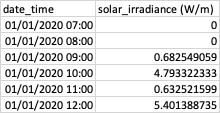
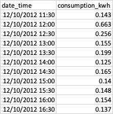

# Solar PV and Battery Optimiser

## Overview
This repo contains a solar PV and battery optimiser.

## Installation
To install the optimiser, run the following commands:
1. clone the repo to your local machine
2. navigate to the repo directory
3. create and activate a virtual environment using the following commands:
```bash
python3 -m venv venv
source venv/bin/activate
```
4. install the requirements using the following command:
```bash
pip install -r requirements.txt
```

## Usage
### Inputs
The optimiser requires the following inputs:
1. **Solar irradiance** - the solar irradiance in W/m2. An example of this input can be seen below

- **Energy demand profile** - the energy demand profile in kWh. An example of this input can be seen 
below


### Arguments
The optimiser takes the following arguments (these can be seen by running `python run.py --help` in the commandline):
- `--solar_irradiance_path` (required) - the path to the solar irradiance csv file
- `--energy_demand_profile_path` (required) - the path to the energy demand profile csv file
- `--logging_level` - the logging level to use (default is `INFO`)
- `--output_path` (required) - the path to save the optimisation results to 
- `--solar_array_size` (default=100) - the size of the solar array in m2
- `--initial_battery_capacity` (default=0.0) - the initial battery capacity in kWh
- `--battery_degredation_rate` (default=0.01) - the battery degradation rate in kWh of electricity per kWh of battery capacity
- `--optimisation_objective` (default="minimise_battery_cap") - the optimisation objective to use (either `minimise_battery_cap` or `minimise_battery_and_solar_cost`)
- `--battery_capex` - the battery capex in £/kWh
- `--solar_capex` - the solar capex in £/m2

### Outputs
The optimiser outputs the following:
- **Optimisation results** - the optimisation results are saved as a CSV to the `output_path` specified in the arguments.
- **Optimisation plots** - the optimisation results are also plotted and saved to the `output_path` specified in the arguments.
- **Commandline logs** - a summary of some of the optimisation results are also logged to the commandline.

### Running the optimiser
The optimiser can be run in two ways:
1. Minimise the battery capacity required to meet the energy demand profile. In this mode the battery and PV CAPEX are not considered.
```bash
python run.py --solar_irradiance_path <path_to_solar_irradiance_file> --energy_demand_profile_path <path_to_energy_demand_profile_file> --optimisation_objective "minimise_battery_cap" --output_path <path_to_save_results_to> --solar_array_size <solar_array_size> --initial_battery_capacity <initial_battery_capacity> --battery_degredation_rate <battery_degredation_rate>
```
2. Minimise the total CAPEX of the system (battery and PV). In this mode the PV size is no longer an input argument and is instead optimised.
```bash
python run.py --solar_irradiance_path <path_to_solar_irradiance_file> --energy_demand_profile_path <path_to_energy_demand_profile_file> --optimisation_objective "minimise_battery_and_solar_cost" --output_path <path_to_save_results_to> --initial_battery_capacity <initial_battery_capacity> --battery_degredation_rate <battery_degredation_rate> --battery_capex <battery_capex> --solar_capex <solar_capex>
```

